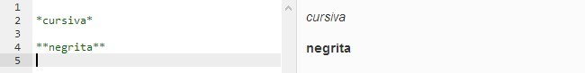

# ***MarkDown***

## Qué es MarkDown

Markdown es un lenguaje de marcado que facilita la aplicación de formato a un texto empleando una serie de caracteres de una forma especial. En principio, fue pensado para elaborar textos cuyo destino iba a ser la web con más rapidez y sencillez que si estuviésemos empleando directamente HTML. Y si bien ese suele ser el mejor uso que podemos darle, también podemos emplearlo para cualquier tipo de texto, independientemente de cual vaya a ser su destino.  Markdown es realmente dos cosas: por un lado, el lenguaje; por otro, una herramienta de software que convierte el lenguaje en HTML válido.

## Cómo funciona y su sintaxis

Para entenderlo mejor, veámos el siguiente ejemplo: Queremos escribir un encabezado de nivel 1. Esto en HTML se hace con la etiqueta h1. Por lo tanto, escribiríamos la correspondiente sintaxis, sin embargo, con 
Markdown no necesitaríamos escribir la etiqueta, sino tan sólo poner una almohadilla al principio:

~~~
     # Encabezado
~~~

Cuando el programa interprete el Markdown, lo convertirá al HTML correcto: en lugar de escribir nueve caracteres, hemos escrito uno para conseguir lo mismo. Si imaginamos que en lugar de una sola línea se trata de un texto mucho más extenso y con mucho formato que aplicar (más encabezados, listas, e incluso tablas), la utilidad del Markdown se vuelve evidente.

### *Sintaxis* 

La sintaxis es muy sencilla y cuenta con varias opciones diferentes para algunos de sus elementos. Básicamente, se trata de añadir ciertos caracteres al inicio de la línea o antes y después de los elementos a los que vamos a aplicar el formato. Veamos a continuación tan sólo algunos ejemplos para hacernos una idea de su sencillez de uso.

Como hemos visto en el ejemplo anterior, los encabezados se crean poniendo almohadillas. El número de almohadillas que pongamos se corresponderá con el nivel de encabezado que queremos usar.

Para **enfatizar**, usamos los asteriscos antes y después de las palabras. Dado que hay dos formas de enfatizar, cursivas y negritas, usaremos un asterisco antes y después para las cursivas y dos asteriscos para las negritas, ambos sin espacios.

En cuanto a las **listas**, dado que en HTML hay de dos tipos, numeradas y sin numerar (u ordenadas y desordenadas), usaremos números seguidos de un punto y un espacio para cada elemento en el caso de las primeras y asteriscos y un espacio (ahora sólo al principio), signos más o guiones para las segundas.

Estos son los elementos basicos. Para conocer más elementos de la sintaxis podemos dirigirnos a la pagina original de uno de sus creadores John Gruber : http://daringfireball.net/projects/markdown/syntax 
(Para contenido en español tenemos la pagina de Joe Di Castro : http://joedicastro.com/pages/markdown.html )

## Ventajas de usar Markdown

##### *Escribir para web es más rápido y cómodo*

Una vez que te acostumbras y conoces mínimamente la sintaxis, completas el texto más rápido. 

##### *Es más difícil cometer errores de sintaxis*

El HTML básico, que es el que necesitamos para dar formato a un texto, es sumamente sencillo de usar. Pero también es muy fácil cometer errores. El más habitual: olvidarse de cerrar una etiqueta de manera adecuada. Markdown hace que un error tan común como éste no se produzca.

##### *Es perfecto para usarlo con editores de texto minimalistas*

A mucha gente le gusta escribir en texto plano, utilizando editores de texto o procesadores minimalistas.

##### *Es ideal para el entorno móvil*

Si usamos una aplicación que soporta Markdown, tan sólo se trata de escribir unos pocos caracteres más. Es más rápido y ágil.

