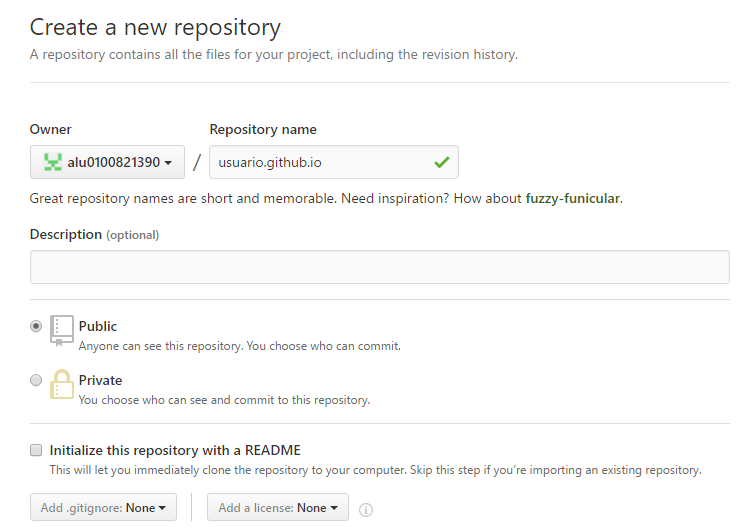
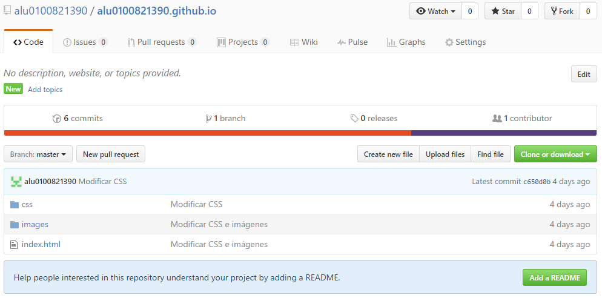

# ***gh-pages***

## Qué es gh-pages

GH-Pages es un servicio de alojamiento web estático de GitHub que nos permite desplegar un sitio web en la nube, a partir de un repositorio de GitHub.

Sin embargo, GH-Pages no soporta código del lado del servidor como *PHP*, *Ruby* o *Python*.(https://help.github.com/articles/user-organization-and-project-pages/).

## gh-pages para usuarios u organizaciones

Para crear un sitio web para nuestro usuario u organización, tenemos que ir a GitHub y crear un nuevo repositorio que, forzosamente debe empezar con nuestro nombre de usuario u organización seguido de *github.io*. Por ejemplo *nombreDeUsuario.github.io*.

Con el nuevo repositorio ya creado, podemos empezar a crear commits y subir los ficheros al repositorio, tal como haríamos con cualquier otro, ya se clonándolo:

~~~~
    $ git clone https://github.com/nombreDeUsuario/nombreDeUsuario.github.io
~~~~

o vinculándolo como remoto:

~~~~
    $ git remote add origin https://github.com/nombreDeUsuario/nombreDeUsuario.github.io
~~~~

Una vez subidos todos los ficheros necesarios para el correcto funcionamiento de la página, podemos ir viendo los cambios de ésta desde la dirección *http://nombreDeUsuario.github.io*.

## gh-pages para proyectos

Además de generar un sitio web para nuestro usuario u organización, podemos hacerlo para nuestros proyectos. Para ello tenemos que crear un repositorio o ir a uno que ya tengamos creado.

Cuando hayamos creado todos los commits y subido los ficheros necesarios para la página (al igual que hicimos anteriormente para usuarios u organizaciones), creamos una nueva rama con el nombre *gh-pages*:

~~~~
    $ git branch gh-pages
~~~~

Ahora simplemente empujamos esos cambios de nuestro repositorio lolal a nuestro repositorio remoto:

~~~~
    $ git push origin gh-pages
~~~~

Una vez hecho ésto, podemos ir viendo los cambios del sitio web desde la dirección *http://nombreDeUsuario.github.io/repositorio*.
