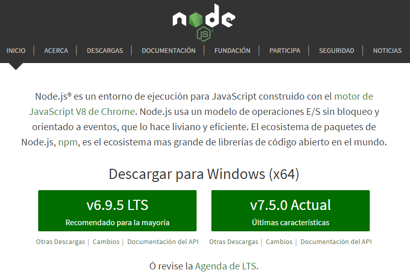
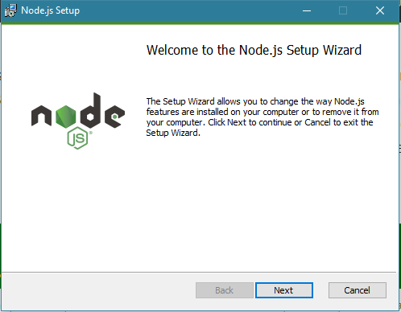

# ***NodeJS***

## Qué es NodeJS

NodeJS es un entorno de programación del lado del servidor que se basa en Javascript y su arquitectura está orientada a eventos. Está pensado para la programación asíncrona y, con él, somos capaces de mejorar el rendimiento de una Web que necesite actualizar sus datos constantemente.

Su meta es permitir a un programador construir aplicaciones altamente escalables, así como escribir código que maneje decenas de miles de conexiones simultáneas en una sólo una máquina física.

NodeJS, además, contiene varios módulos que nos permiten hacer un mejor uso de este lenguaje. Estos módulos suelen instalarse a través del Node Package Manager (npm), el cual facilita la compilación, instalación y actualización de los módulos que vayamos a utilizar.

## Qué es npm

npm (Node Package Manager) es un gestor de paquetes de NodeJS, que nos permite descargar librerías y enlazarlas, o descargar programas de JS.

Los paquetes de npm se deben instalar desde el símbolo del sistema de NodeJS.

## Instalar NodeJS

La instalación de NodeJS en Windows es tan sencilla como descargar el instalador desde la [página](https://nodejs.org/es/) de NodeJS

Lo ejecutamos, y seguimos los pasos del instalador

Una vez finalizado tendremos instaladas dos aplicaciones, el propio intérprete NodeJS y el símbolo del sistema de NodeJS, desde el cual instalamos los paquetes npm, como por ejemplo, Gitbook, con los siguientes comandos:

~~~
    $ npm install -g gitbook-cli
    $ npm install -g gitbook
~~~
