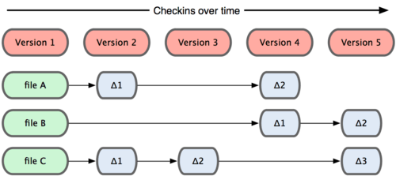

# ¿Qué es Git?

Git es un software de control de versiones,
pensando en la eficiencia y la confiabilidad del mantenimiento de versiones de aplicaciones cuando éstas tienen un gran número de archivos de código fuente.
Git se ha convertido en sistema de control de versiones con funcionalidad plena.

### Instantáneas

La principal diferencia entre Git y cualquier otro VCS 
es cómo Git modela sus datos. Conceptualmente,
la mayoría de los demás sistemas almacenan la información como una lista de cambios en los archivos.

Git no modela ni almacena sus datos de este modo. En cambio,
Git modela sus datos más como un conjunto de instantáneas de un mini sistema de archivos.
Cada vez que confirmas un cambio, o guardas el estado de tu proyecto en Git,
él básicamente hace una foto del aspecto de todos tus archivos en ese momento,
y guarda una referencia a esa instantánea. Para ser eficiente,
si los archivos no se han modificado, Git no almacena el archivo de nuevo,
sólo un enlace al archivo anterior idéntico que ya tiene almacenado.

### Estados

Git tiene tres estados principales en los que se pueden encontrar tus archivos:
confirmado (committed), modificado (modified), y preparado (staged).
Confirmado significa que los datos están almacenados de manera segura en tu base de datos local.
Modificado significa que has modificado el archivo pero todavía no lo has confirmado a tu base de datos.
Preparado significa que has marcado un archivo modificado en su versión actual para que vaya en tu próxima confirmación.

Esto nos lleva a las tres secciones principales de un proyecto de Git:
el directorio de Git (Git directory), el directorio de trabajo (working directory),
y el área de preparación (staging area).

El flujo de trabajo básico en Git es algo así:

1. Modificas una serie de archivos en tu directorio de trabajo.
2. Preparas los archivos, añadiendolos a tu área de preparación.
3. Confirmas los cambios, lo que toma los archivos tal y como están en el área de preparación,
y almacena esas instantáneas de manera permanente en tu directorio de Git.

### Instalación

Para instalar Git, necesitas tener las siguientes librerías de las que Git depende:
curl, zlib, openssl, expat y libiconv. Por ejemplo, si estás en un sistema que tiene yum
(como Fedora) o apt-get (como un sistema basado en Debian), 
puedes usar estos comandos para instalar todas las dependencias:
~~~
$ yum install curl-devel expat-devel gettext-devel \
  openssl-devel zlib-devel

$ apt-get install libcurl4-gnutls-dev libexpat1-dev gettext \
  libz-dev libssl-dev
~~~

Cuando tengas todas las dependencias necesarias, puedes descargar la versión más reciente de Git desde su página web:
~~~
< http://git-scm.com/download >
~~~

Luego compila e instala:
~~~
$ tar -zxf git-1.6.0.5.tar.gz
$ cd git-1.6.0.5
$ make prefix=/usr/local all
$ sudo make prefix=/usr/local install
~~~

Una vez hecho esto, también puedes obtener Git, a través del propio Git, para futuras actualizaciones:
~~~
$ git clone git://git.kernel.org/pub/scm/git/git.git
~~~

### Inicializando Repositorio

Si estás empezando el seguimiento en Git de un proyecto existente, necesitas ir al directorio del proyecto y escribir:
~~~
$ git init
~~~
Esto crea un nuevo subdirectorio llamado .git que contiene todos los archivos necesarios
del repositorio —un esqueleto de un repositorio Git.

Si deseas empezar a controlar versiones de archivos existentes
(a diferencia de un directorio vacío), probablemente deberías comenzar el seguimiento de esos
archivos y hacer una confirmación inicial. Puedes conseguirlo con unos pocos comandos git add
para especificar qué archivos quieres controlar, seguidos de un commit para confirmar los cambios:
~~~
$ git add *.c
$ git add README
$ git commit –m 'versión inicial del proyecto'
~~~