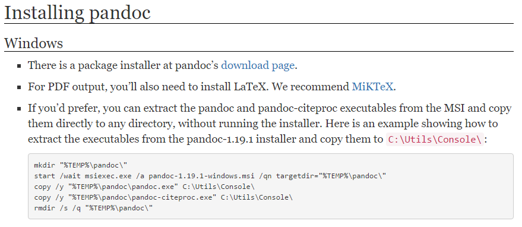
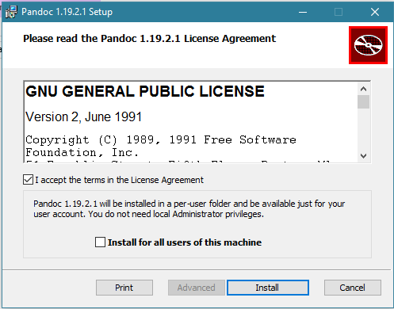

# ***Pandoc***

## Qué es Pandoc

Pandoc es un conversor de documentos libre y de código abierto, mayormente usado como una herramienta de escritura, y es una base para la publicación de flujos de trabajo. Fue creado originalmente por John MacFarlane, un profesor de Filosofía en la Universidad de California, Berkeley.

## Utilidad y Soporte
Pandoc es especialmente útil para diseñadores web y bloggers ya que se centra en la conversión de diferentes formatos extendidos en dicha comunidad. Por ejemplo, es capaz de convertir HTML a Markdown y viceversa.

Uno de los puntos fuertes de Pandoc es que dispone de múltiples versiones.

Aunque originalmente esta escrito en Haskell (un lenguaje de programación puramente funcional y fuertemente tipado), ha sido portado a Mac, Linux, Windows e incluso FreeBSD, pero lo mejor de todo es que también dispone de una versión online totalmente funcional.

## Conversiones
Pandoc puede convertir desde Markdown (extendido o estricto), reStructuredText, HTML y LaTeX a los siguientes formatos:

+ HTML
+ Markdown (extendido o estricto)
+ reStructuredText
+ LaTeX
+ ConTeXt
+ DocBook
+ Groff man
+ RTF
+ OpenDocument XML
+ Texinfo
+ MediaWiki

También es posible obtener archivos PDF a partir de los formatos de entrada mencionados, por medio de un script, eso si.

## Instalar Pandoc

Instalar Pandoc en Windows es tan simple como ir a la [página de desarga oficial](http://pandoc.org/installing.html)

descargar el instalador, ejecutarlo y seguir los pasos hasta terminar la instalación

